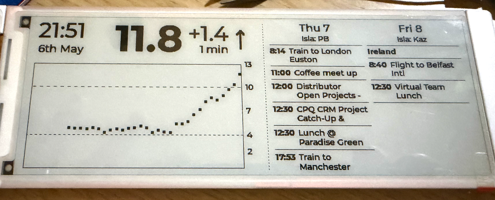

# e-ink sugar

Personal blood-sugar (CGM) dashboard for an Elecrow 5.79" e-paper panel driven by an ESP32-S3.



The device wakes on the CGM's 5-minute publish rhythm, fetches the latest readings from a Nightscout-style endpoint, fetches today/tomorrow's events from up to three Google calendars, renders one frame to the e-paper, then deep-sleeps until ~10 seconds after the next expected reading.

## What's on screen

**Left zone — blood sugar dashboard**

- Clock (`21:51`) and date (`6th May`) at top-left
- Big bold current BG reading with a strikethrough when the latest data is older than 15 minutes
- Signed delta vs the previous reading and minutes-since-last-reading (`+1.4`, `1 min`)
- Trend arrow (Flat / FortyFiveUp / DoubleDown etc., the Nightscout direction strings) drawn as crisp vector polylines
- Time-aware scatter chart of the last 3 hours plotting each reading at its actual timestamp — CGM dropouts show as genuine spatial gaps, not a misleading line jumping across them
- Auto-scaled Y axis (top = `max(reading + 1, 10)` mmol/L) with dashed threshold lines at 4 and 10 mmol/L

**Right zone — agenda**

- Two columns (today + tomorrow, or tomorrow + day-after if today's timed events are all done)
- Day header with a per-day "Isla: PB / Kaz" subtitle from a shared family calendar
- All-day events shown as a bold white-on-black banner at the top of each column
- Timed events with bold `HH:MM` time prefix (fixed-width slot so titles align), regular wrapping titles
- Single-line crop with `…` so a busy day still fits in the column

## Hardware

- **Elecrow CrowPanel ESP32-S3 5.79" e-paper HMI display** — 272×792 dual-SSD1683 panel (`GxEPD2_579_GDEY0579T93`), driven landscape (792×272 pixels)
- ESP32-S3 with PSRAM, 8 MB flash

[Product page](https://www.elecrow.com/crowpanel-esp32-5-79-e-paper-hmi-display-with-272-792-resolution-black-white-color-driven-by-spi-interface.html)

## Software stack

- Arduino framework via PlatformIO
- LVGL 9 for the UI (hand-coded landscape layout, not SquareLine)
- GxEPD2 driving the e-paper
- Custom-generated Montserrat-Bold fonts (72 / 18 / 14 px) for the BG number, all-day banner, and event time prefixes; regenerate with `lv_font_conv` if you want different sizes
- Plain line-by-line TSV / iCal parsing — no JSON dependency on-device
- Stream-skipping iCal parser handles 1000+-event calendars by ignoring `VEVENT`s outside the `[today-14, today+5]` window before parsing further
- NVS-backed (`Preferences`) runtime config plus an on-device setup mode
- `ricmoo/QRCode` for the setup-mode QR codes

## First-time setup (flashing from source)

1. Install [PlatformIO](https://platformio.org/) (CLI or VS Code extension).
2. Clone this repo.
3. Copy `src/secrets.example.h` to `src/secrets.h` and fill in your values:
   - `SSID_NAME` / `SSID_PASSWORD` — your Wi-Fi
   - `BG_API_URL` — your Nightscout-style `entries.txt` endpoint (e.g. `https://your-host/api/v1/entries.txt?count=36`)
   - `ICAL_ISLA_URL` / `ICAL_PERSONAL_URL` / `ICAL_WORK_URL` — Google Calendar "Secret address in iCal format" URLs
4. Build and flash:
   ```
   pio run -t upload
   pio device monitor    # serial @ 115200
   ```

`secrets.h` is gitignored — your real credentials never get committed.

## On-device reconfiguration (setup mode)

Once flashed, the device can be reconfigured without re-flashing.

1. **Trigger setup mode**: hold the button on `BUTTON_PIN` (default `GPIO 2` — adjust in `src/main.cpp` if yours is different) at boot, or press it to wake the device from deep sleep. The screen will swap to a setup page with two QR codes.
2. **Join the device's Wi-Fi**: scan the left QR (or manually connect to SSID `esugar-setup` / password `pleaseconfigure`).
3. **Open the config page**: scan the right QR (or visit `http://192.168.4.1/`). You'll get a form pre-filled with the current values.
4. **Edit, save**: blank fields keep the current value; non-blank fields overwrite. Hitting **Save & reboot** persists the new config to NVS and reboots the device into normal mode picking up the new values.
5. **Cancel**: reboots without saving.

The new config survives flashes — `secrets.h` is only consulted on first boot when NVS is empty (or after `Preferences::clear()`).

If you don't interact for 10 minutes, setup mode deep-sleeps to save battery.

## License

MIT — see [LICENSE](LICENSE).
